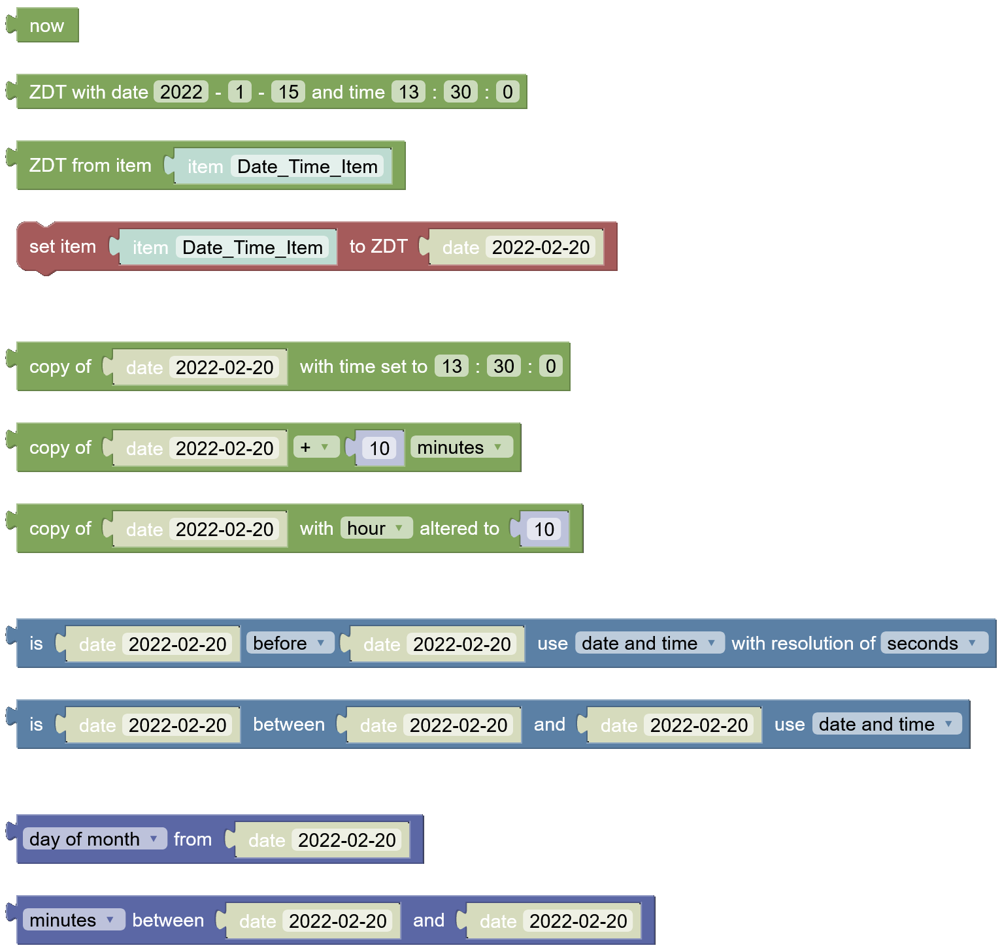

This Library adds support to get, create, compare and modify Times and Dates with Blockly.

## Blocks
> **Creation of ZonedDateTime with Ephemeris -> date block**  
>   
> Please be aware that the existing blocks for dates set their time to 0 and the zone offset to UTC. Although the date block is set as shadow in all blocks of this library, it should not be used. If you compare dates only it does not matter.

### now
Obtains the current date-time from the system clock in the default time-zone.  

### ZDT with date \<year\>-\<month\>-\<day\> and time \<hour\>:\<minute\>:\<second\>
Creates a ZonedDateTime based on the given input for date and time with nanos set to 0 and the system's time-zone. Values must be valid.  
[details="Allowed values"]
year: the year  
month: 1 to 12  
day: 1 to 28-31  
hour: 0 to 23  
minute: 0 to 59  
second: 0 to 59
[/details]  

### ZDT from item \<item\>
Get the ZonedDateTime from item's state. Error if item is undef/NULL.  

### set item \<item\> to ZDT \<zdt\>
Update state of a DateTime item to the provided ZonedDateTime.  

### copy of \<zdt\> with time set to \<hour\>:\<minute\>:\<second\>
Returns a copy of the provided ZonedDateTime with hours, minutes and seconds altered.  

[details="Allowed values"]
hour: 0 to 23  
minute: 0 to 59  
second: 0 to 59
[/details]

### copy of \<zdt\> +/- \<number\> \<datetime_unit\>
Returns a copy of the provided ZonedDateTime with the specified value added or subtracted.  

### copy of \<zdt\> with \<datetime_unit\> altered to \<number\>
Returns a copy of the provided ZonedDateTime with the selected field altered.  

### is \<zdt1\> before/after/equal \<zdt2\> use date and time/date/time with resolution of \<datetime_unit\>
Checks if the instant of the first ZonedDateTime is before/after/equal that of the second ZonedDateTime. You can select if you want to compare all components, date only or time only. 

### get \<datetime_unit\> from \<zdt\>
Returns the selected unit as number.  

### \<datetime_unit\> between \<zdt1\> and \<zdt2\>
Calculates the amount of time between two ZonedDateTime objects. The result will be negative if the second object is before the first one.  

## Changelog
### Version 0.1
- initial release

## Resources
[https://raw.githubusercontent.com/deibich/openhab-libraries/087e40420171e64a7c0540be28cf6caf5599b0e0/blockly/libraries/datetime/datetime.yaml](https://raw.githubusercontent.com/deibich/openhab-libraries/087e40420171e64a7c0540be28cf6caf5599b0e0/blockly/libraries/datetime/datetime.yaml)